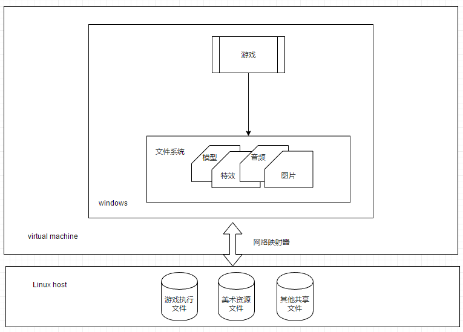
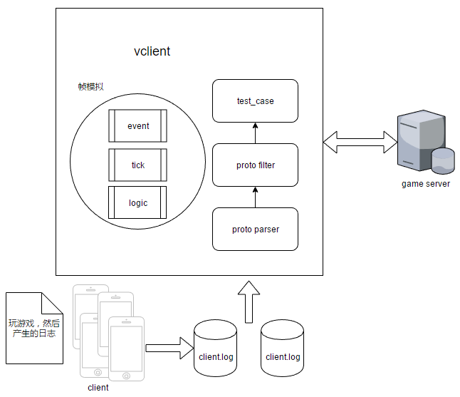

## 美术资源文件包体减小方法

- 着重方法的新颖性和实用性
- 简介：游戏都是靠颜值吃饭的，所以游戏的美术资源开发是游戏研发的重要部分，游戏在每个版本的迭代过程中都会产生多余的美术资源，例如：人物贴图，场景文件等等。现有的技术方案：通过源代码文件递归查找，入口点难以确定，美术资源文件可能不规范。**我的解决方案**：，游戏可执行文件和美术资源文件都存储在Linux系统上，Linux系统通过虚拟化软件的共享文件夹方式，将游戏运行需要的资源提供给windows系统，windows系统上能够正常运行游戏。对整个游戏进行全量回归，通过Linux提供的文件监听接口对所有游戏文件进行监控，标记游戏过程中用到的美术资源。

- **核心技术点**，Linux提供了方便的inotify特性，能够方便的监控文件系统的变化
- VM
  - CPU的虚拟化，hypervisor区分guestOS的指令并虚拟了所有的CPU的寄存器，如果是Ring0级权限才能执行的指令hypervisor会介入执行（guestOS抛出fault），并修改相关的寄存器值，如果不是Ring0则直接把指令跑在真实的CPU上
  - 内存的虚拟化，hypervisor维护了一个guestOS的虚拟的物理内存到真实的物理内存的表，所以VM的进程访问内存会多一步地址翻译
  - IO虚拟化，由于操作IO实际上是进程写内存，内核帮助把这些数据写到设备的寄存器中，所以IO虚拟化时hypervisor实际是把内核的工作监控了自己做，例如：guestOS写磁盘，hypervisor则写hostOS上的虚拟机文件
- docker，解决生产环境和开发环境的一致性问题，docker和VM比较docker实际是一个进程
  - namespace，名字空间，分离进程树、网络接口、挂载点和进程间通信等资源的方法
  - control groups，也叫CGroups，用于隔离计算机的物理资源，如CPU、内存和网络带宽等
  - union filesystem，UnionFS实现了docker的镜像管理，当使用commit提交一个container时docker会在原有的镜像上增加一个只读层写入修改

### 基于游戏客户端协议日志的BUG复现与自动化测试方法

- 简介：通过hook客户端network模块实现协议日志的监听，设计并实现游戏的虚拟客户端用于重放客户端协议，通过在游戏内的观战方法对BUG进行复现。需要完全了解服务器从底层引擎到上层脚本实现的每个细节，让我对如果设计高可用的服务器架构有了新的认识，之后很容易可以想明白Nginx和redis的工作原理，并且还能提出redis还有什么可以改进的

- hook客户端network模块，在python代码初始化网络模块后为每条发送的协议设置钩子，实际是get module attribute和set module attribute的过程
- 虚拟客户端：引擎层：基于libevent编写的单线程异步socket通信库，脚本层实现基于状态机和帧同步的多客户端模拟器
  - libevent，socket可读可写事件的IO复用实现：使用select或epoll系统原语实现，可读好监听，可写通过先写缓冲区在询问操作系统socket是否可写实现。timer的实现，交给内核处理，通过epoll_wait实现
    - reactor：注册事件，事件分离器等待事件，事件分离器同时注册事件的人处理事件，能收了你跟俺说一声
    - proactor：把事件的处理函数交给事件分离器，事件分离器等待事件和事件处理完成，然后通知调用者，你给我收十个字节，收好了跟俺说一声
    - select，poll和epoll的区别，select和poll都是线性扫描所有监听的文件描述符，扫描出ready或error的，poll没有数量限制，epoll则由操作系统直接提供原语实现，通过内存映射到内核，由内核激活和唤起ready后的回调函数
  - 状态机和帧同步一般是绑定的设计模式，帧同步主要是模拟客户端隔固定帧数通过发送消息（协议）的方式与服务器同步玩家状态，而通过状态切换到不同的状态机模块中去执行相关游戏逻辑
  - 协议解析：通过正则表达式和python的解释性执行的特性完成对发送协议的协议名和相关参数的解析eval
  - 模拟的虚拟客户端体量问题：
    - 通过docker构建的压测平台运行，真实操作：需要模拟1.2w人的运行情况，则开7个docker container每个docker container运行2-3个虚拟客户端进程，每个虚拟客户端跑600人
    - 为什么每个进程只能模拟600人？因为协议的收发和处理并不吃太多的CPU，而每个模拟客户端需要输出大量日志跟踪玩家状态，用于问题跟踪，所以不应该开太多客户端，而且由于600 x 20刚好是1.2w所以就选用了600
  - 服务器出了什么致命问题（说几个容易描述的）：
    - 1.TCMalloc内存分配
    - 大量机器人并发登入时mongo数据库同步查询导致大量玩家登入失败
    - 好友列表申请长度为做限制，导致好友申请列表挤爆内存
    - 管理节点master做消息转发时未限制每个玩家一段时间内的转发量，导致CPU90%
    - 大量玩家同时拉取排行榜数据，排行榜缓存数据未生效，导致请求队列过长影响后续匹配请求处理
      - 原因：例如有1k个请求（对整个数据库排序本来就是慢查询，而且是用一个for循环所有排行榜一起查出来），一开始都缓存不命中，都去查询数据库直接导致卡顿
      - 改进方案：利用定时任务更新排行榜数据到缓存，每个客户端请求排行榜只请求缓存

## 服务器内存泄漏分析

- GIL：一个python进程同一时刻只有一个线程运行，CPython实现造成，线程在运行的时候即拿到GIL锁，交出CPU控制权前释放锁，Python的多线程只适合编写非CPU型的应用，例如：IO密集型应用，通过多进程的方式实现并行
- python一个变量的内存，可以从python源码的object定义上看出来，例如一个空的str，对于一个32位的机器而言，有8bit的object header用于记录类型信息，8bit的ob_shash long型整数用于记录hash值，还有4bit的ob_sstate int型整数用于表示该str是否被intern机制处理，因为str是不可修改的，相当于每次new出来的str对象都被放在了一个缓存池中，最后还有1bit的char数组，一共21bit，可以通过sys.getsizeof得到
- LRU和LFU算法，两个都是最近最少使用算法，前者是按时间序淘汰缓存（队列实现+map），后者是通过次数淘汰缓存（堆+map）
- [Linux并发与同步](http://www.cnblogs.com/vamei/archive/2012/10/09/2715393.html)：**利用互斥锁mutex、条件变量和读写锁构成原子操作**（只有一个线程的原子操作不被乱序，处理竞争条件）**进行同步**，互斥锁就是锁，条件变量的好处在于把check条件成立的操作交给系统完成，系统在检测到条件成立时就唤起等待的线程，读写锁则把锁分成三个状态，共享锁，写锁和释放，这样可以提供系统的并发时的吞吐量，对于条件变量一般py或java实现为wait，notify和notify_all的接口
- Linux进程间通信：
  - [信号量](https://blog.csdn.net/ljianhui/article/details/10243617)，用于协调进程对共享资源的访问，P等待，V释放，操作系统保证在并发情况下是原子的
  - 信号，信号是通过kill发送给进程的
  - 共享内存，通过这个shmget函数设置共享内存地址，由于无法做到写内存的互斥性需要通过信号量来实现
  - 管道，通过内核缓冲区实现，数据只能单行传输，一个进程的标准输出作为管道的输入，另一个进程的标准输入从管道中获取数据
- 发现的问题：
  - 游戏中存在大量可击碎物件，每个可击碎物件都会被场景引用，而为了找到可击碎物件对应的场景，会保留一个场景的对象，在玩家将可击碎物件击碎后，这段内存并没有释放，而这段内存已经不需要了
    - 改进方法：把每个可击碎对象改成weakref

### Express Service

- 物流报告：通过模拟浏览器的方式（phantomjs）登入CAS统一认证平台并爬取物流系统输出在CAT上的日志，分析日志中的物流数据（通过xpath），生成邮件报告每天发送给领导查阅

- 物流查询服务：1. 定时更新物流信息；2. 对接所有物流公司的查询接口（菜鸟、圆通）；
  - 整个物流服务由Spring-boot编写，通过13个docker container跑起来，用Mesos做容器管理，AUG项目（权限管理）+Nginx做的负载均衡，物流服务包括：B端、C端接口、物流查询接口等等
  - 通过python编写多线程任务执行器（多线程为了触发多个任务同时执行），读取预先设置在redis中的任务，实际是调用物流服务的接口参数
  - 任务的实际执行者是Spring-boot编写的物流服务
- 虚假发货：1. 定义：买家操作了发货，但实际未发货（根据物流信息），根据商品不同有2d和4d发货后的物流信息更新期限
- [MySql物流数据向Hbase转型](http://stor.51cto.com/art/201806/576466.htm)，
- 物流投诉：
- [CAT](https://github.com/dianping/cat)
- CAS，单点登入，SSO，用户在CAS登入后，CAS服务器会给用户签发一个Ticket Grangting Ticket(TGT)，给用户保存在浏览器Cookie中

- OAuth，一个授权协议，授权第三方服务访问用户数据的协议，这个Client就是第三方服务，第三方服务发起认证请求到Resource Owner，Resource Owner返回认证页面，由客户端确认后，Resource Owner返回第三方服务许可证，第三方服务再拿许可证到认证服务器拿到Access Token，最后用Access Token访问实际的资源服务器

- Mesos

- Nginx实现负载均衡，通过统计服务器的连接数、处理请求数和客户端IP Hash值决定此次连接由哪台server处理
  - 反向代理为什么叫反向代理：正向代理，代理的是客户端，在server看来所有的client请求都是来自proxy，而反向代理代理的是Server，在Client看来所有的Server都是Nginx
  - Master-Worker模式，当运行nginx -s reload之后，master会读取conf创建新的worker进程，老的worker进程会在处理完请求后被kill掉，worker进程采用epoll模型处理
  - 动静分离，静态资源由Nginx管理即可
- redis多线程读取任务并标记任务已读取，通过setnx加锁解决多线程访问时同时标记任务的情况（悲观锁）
  - redis中的事务，乐观锁，利用watch关键字实现，可以watch一个变量，知道exec提交，在此期间如果watch的变量改变则之间失败当前的操作。想法：我觉得不太好，可以采用proactor模型，因为redis单线程本身保证了命令执行的线性化，所以可以直接通过一个连接向redis提交get get callback 和set三个操作给redis，redis执行完返回，如果怕get callback是使用者的逻辑不可控，可以交给使用者自己优化
  - redis持久化，可以手动执行，也可以通过conf文件配置成定时执行（SAVE通过主进程备份，BGSAVE通过子进程备份，前者备份是redis无法工作，后者工作时只备份接收命令时刻的redis状态），还可以通过AOF记录写数据库命令日志的方式进行备份，开启AOF主进程都是先写缓存然后看配置决定写AOF文件的时间点
- Spring-boot，对比springmvc，springboot更加轻量，适合快速开发，省去了需要xml的配置